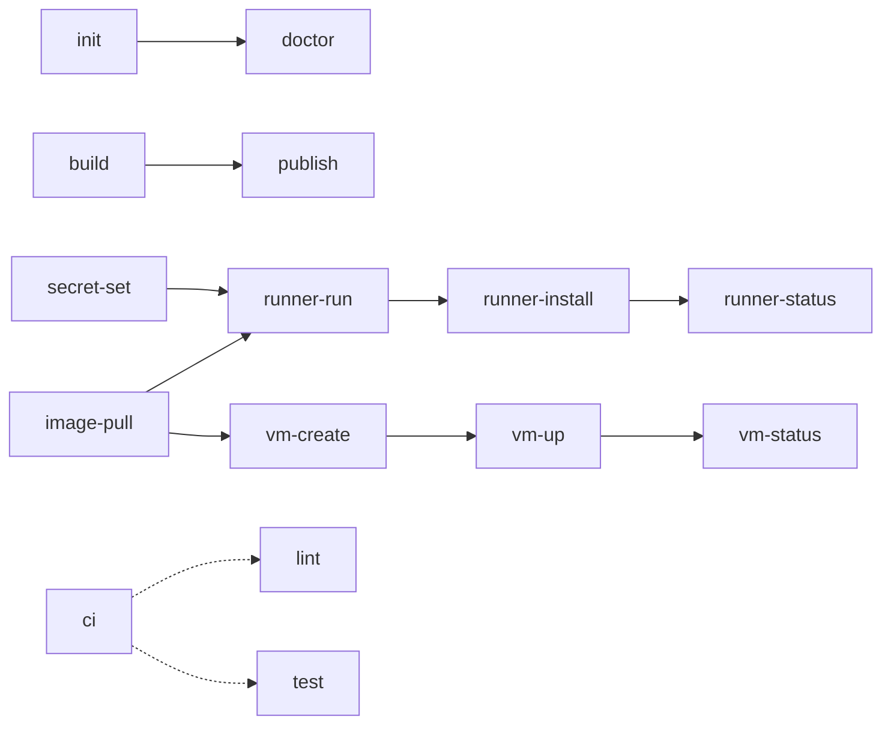

# Makefile Reference

The [`Makefile`](./Makefile) is the single source of truth for building the agent image
and running VMs cloned from it. Run `make help` for the quick target list; this file is
the narrative reference.

## Target overview

`runner-run` and `runner-install` are the normal way to run VMs: a fresh VM per
session. `vm-up` (`vm-start` followed by `vm-configure`) gives a persistent VM for
debugging. Dotted arrows are independent gates.

## Variables

| Variable | Default | Used by |
| --- | --- | --- |
| `VM` | none (required) | all `runner-*` and `vm-*`, optional for `secret-set` |
| `IMAGE_REF` | `agent-macos` (from `.env`) | `image-pull`, `vm-create` |
| `VM_CPU` / `VM_MEMORY_GB` | `4` / `12` | `runner-run`, `vm-create` |
| `MODE` | `run` | `doctor`: `run` or `build` |
| `NAME` | none | `secret-set`: `claude-environment-secret` |
| `LOG_LINES` | `100` | `vm-logs` |
| `REGISTRY` | from `.env` | `publish` |

## Targets

### Develop

| Target | Description |
| --- | --- |
| `help` | List targets (default goal) |
| `init` | Creates `.env` from `.env.example`; runs `packer init` when Packer is installed |
| `doctor` | Checks host tools for `MODE` and `.env` presence. Read-only |
| `build` | `packer build`; needs `PKR_VAR_user_password` |
| `lint` | `packer fmt -check`, `shellcheck`, `shfmt -d`, `plutil -lint` |
| `format` | `packer fmt`, `shfmt -w` |
| `test` | `packer validate` and the kcpassword helper's unit tests |
| `ci` / `pre-commit` | `lint` + `test`, what CI runs |
| `clean` | Removes `build/` |

### Runners

| Target | Description |
| --- | --- |
| `runner-run` | `scripts/runner-run.sh`: clone, boot, configure with `EPHEMERAL=true`, wait for the guest to power off, delete, repeat. Foreground; Ctrl-C deletes its VM |
| `runner-install` | `scripts/runner-service.sh install`: host LaunchAgent `com.agent-images.<VM>` running `runner-run.sh`; log in `build/logs/<VM>.runner.log` |
| `runner-uninstall` | Boots out the LaunchAgent (the loop deletes its VM) and removes the plist |
| `runner-status` | LaunchAgent state and loop log, then `vm-status` |

### VMs (manual, persistent; for debugging)

| Target | Description |
| --- | --- |
| `image-pull` | `tart pull $(IMAGE_REF)` on run hosts |
| `vm-create` | `tart clone` then `tart set --cpu --memory` |
| `vm-start` | `tart run --no-graphics` in the background; log in `build/logs/` |
| `vm-configure` | `scripts/vm-configure.sh`: hostname, secrets, `runner.env`, runner restart. Idempotent |
| `vm-up` | `vm-start` + `vm-configure` |
| `vm-stop` / `vm-delete` | `tart stop`; `tart delete` after stopping |
| `vm-status` | `scripts/vm-status.sh`: runner, process, Claude `/healthz`, last log lines |
| `vm-logs` | Tails the guest's `~/Library/Logs/agent-runner.log` |
| `vm-versions` | macOS, Xcode, and Claude Code versions in the guest |
| `vm-list` | `tart list` |
| `secret-set` | `security add-generic-password` into service `agent-images.<NAME>`, account `<VM>` or `default`; prompts for the value |

### Release / Danger

| Target | Description |
| --- | --- |
| `bump` | Bumps `version.txt`; `LEVEL=patch\|minor\|major` |
| `publish` | `tart push` to `$(REGISTRY)/agent-macos:v$(VERSION)`. Requires `CONFIRM_PUBLISH=1` |

## `make doctor`

Checks tools with `command -v` rather than `triage`; swap in a `triage.yaml` when this
repo joins an estate that uses it.

## CI alignment

| Workflow | Target |
| --- | --- |
| `.github/workflows/ci.yml` | `make init`, `make ci` on `macos-latest` |

Image builds don't run in hosted CI: GitHub's macOS runners can't nest Tart VMs.
